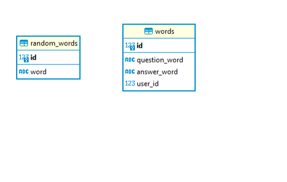

## Flash-cards бот в Телеграм

Этот бот помогает тренероваться в Английском языке. В нём
заложен определённый набор слов, из которого можно удалять слова и добавлять новые для каждого пользователя.

### Inputs

 Личные данные (токен телеграмбота, данные датабазы) хранятся в файле ``` user_personal_data.connections.py ```

 Список начальных слов, заполняющих базу данных хранится в файле ``` user_personal_data.words_for_db.py ```.

### Imports

Хранятся в файле ``` requirements.txt ``` .

### Data Base Preparations

Перед тем как запустится основной код происходит создание (или реновация) базы данных из ``` db_script.py ```.

### Docscreens' list:

- [Главный код](docstring_for_main.md)
- [Код базы данных](docstring_for_db_script.md)

### Data base tables:


